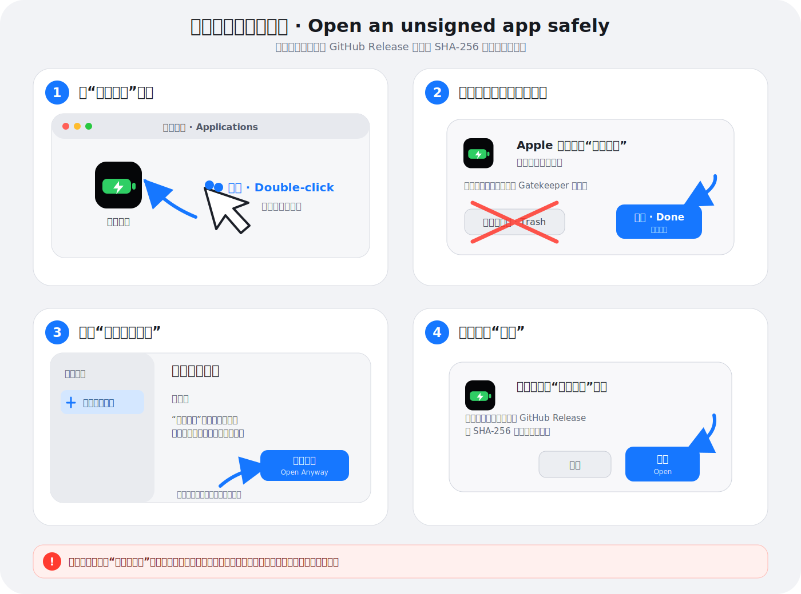
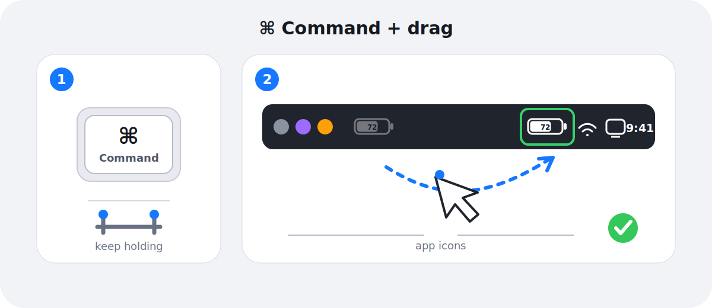

# 电池内显 · BatteryInside

[中文](README.md) · [English](docs/README.en.md) · [日本語](docs/README.ja.md) · [Français](docs/README.fr.md) · [Italiano](docs/README.it.md)


一个轻量、只读的 macOS 菜单栏电池指示器，把电量百分比、剩余电量和供电状态集中显示在一个紧凑图标里。

作者：郭鹏

## 三步安装


1. 从 [Releases](/guopengnaivoc/battery-inside/releases/latest) 下载最新的 `BatteryInside-版本号.dmg`。
2. 打开 DMG，把“电池内显”拖到“应用程序”。
3. 在 Finder → 应用程序中打开“电池内显”。启动后，电池会出现在屏幕顶部菜单栏。

> 从旧版本升级时，请先退出“电池内显”，再把新版拖入“应用程序”并选择“替换”。2.8.4 使用了新的图标资源名称，以绕开部分 Intel Mac 的启动台旧图标缓存；若 Finder 已显示圆角但启动台仍短暂显示方形，重启 Mac 一次即可让系统重新载入。

### 首次打开被 macOS 阻止怎么办？



当前公开版本采用临时签名，尚未使用 Apple Developer ID 签名和公证。如果提示“无法验证开发者”或“Apple 无法检查是否包含恶意软件”：

1. 先尝试打开一次应用，然后关闭警告。
2. 打开“系统设置”→“隐私与安全性”。
3. 向下找到关于“电池内显”的提示，点击“仍要打开”。

只应对从本项目 GitHub Release 下载且 SHA-256 校验一致的安装包执行此操作。不要关闭整个 Gatekeeper。

如果系统明确提示应用“会损坏电脑”、检测到恶意软件或文件已经损坏，请停止操作并重新下载，不要点击“仍要打开”。“仍要打开”按钮通常只在首次尝试启动后约一小时内显示。

参考：[Apple 官方的“通过覆盖安全设置打开应用”说明](https://support.apple.com/guide/mac-help/open-an-app-by-overriding-security-settings-mh40617/mac)。

## 一眼看懂状态


- 30% 及以上：白色填充柱
- 10%–29%：橘黄色填充柱
- 9% 及以下：红色填充柱
- 正在充电：闪电
- 接通电源但没有充电：插头
- 无法读取电池：`--`

填充柱长度会连续跟随电量：`20.8 pt × 百分比`。每 1% 相当于约 `0.208 pt`，使用 Core Graphics 亚像素绘制，因此不要求电池内部必须拥有 100 个整数像素。数字显示精确值，填充柱提供直观估计。外框和右侧电池头始终跟随 macOS 的 `labelColor`；数字、闪电和插头在填充区域内使用黑色，在未填充区域跟随系统颜色，确保深色和浅色菜单栏都清晰。

应用仅使用 macOS 明确提供的 `Is Charging`、`Power Source State` 和 `Is Charged` 判断供电状态。

## 设置与替换系统图标


菜单栏图标是只读的，点击不会弹出菜单。要更改设置，请在 Finder 的“应用程序”中再次打开“电池内显”。设置窗口提供：

- 登录时自动启动
- 20% 和 10% 低电量通知
- 退出应用
- 安全卸载

登录时自动启动为静默模式：重启或重新登录后只出现菜单栏电池，不会弹出设置窗口。需要设置时，再从 Finder → 应用程序打开“电池内显”。

如需让菜单栏只保留“电池内显”，可隐藏系统电池图标：

- 较新 macOS：系统设置 → 菜单栏 → 菜单栏控制项 → 电池 → 关闭菜单栏显示
- macOS 13–15：系统设置 → 控制中心 → 电池 → 关闭“在菜单栏中显示”

这不会删除或修改 macOS 的电池功能，需要恢复时在相同位置重新开启即可。

### 把图标放在其他应用图标的最右侧



1. 按住键盘上的 `Command（⌘）` 键。
2. 保持按住，用鼠标或触控板拖动菜单栏中的“电池内显”。
3. 把它放到其他第三方应用图标的右侧，然后松开。

应用设置了稳定的菜单栏位置记忆标识；完成一次拖动后，macOS 会在重新打开、重启和升级后恢复这个位置。每台新电脑首次安装后需要操作一次。时间、控制中心和隐私指示器等系统项目位于 macOS 保留区域，应用不能移动到这些系统项目的右侧。

## 系统要求与隐私

- macOS 13 或更高版本
- Apple 芯片与 Intel Mac
- 不联网，不收集或上传数据

## 从源码构建

需要 Xcode Command Line Tools，不依赖第三方库：

```zsh
cd work/BatteryInside
./build.sh
./package_dmg.sh
```

构建产物保存在仓库根目录的 `outputs/`。

## 版权

Copyright © 2026 郭鹏。当前仓库未附带开源许可证；公开可见不代表授予复制、修改或再分发许可。
