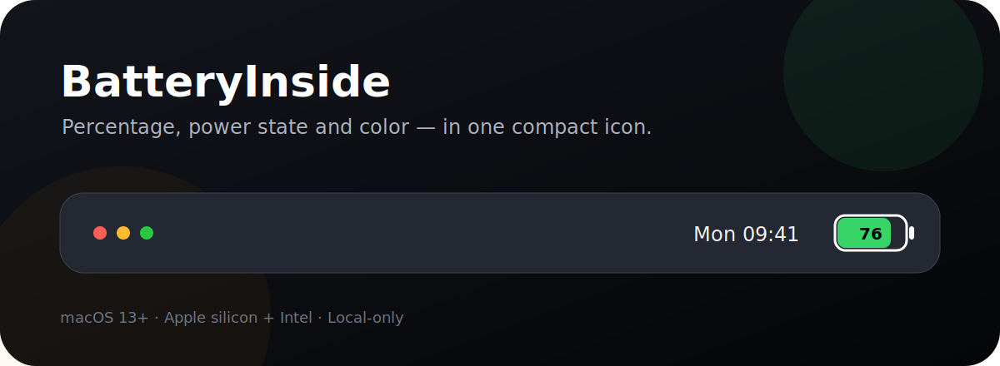
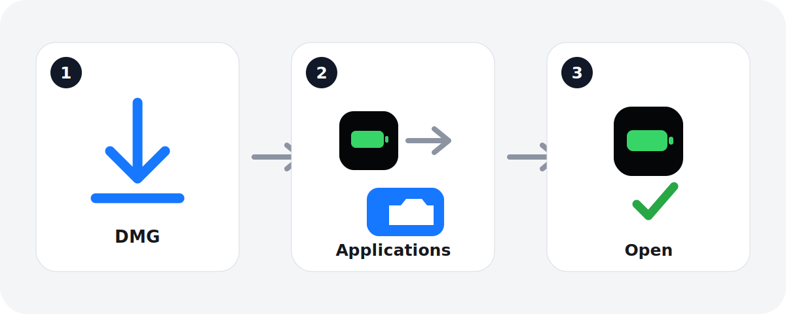
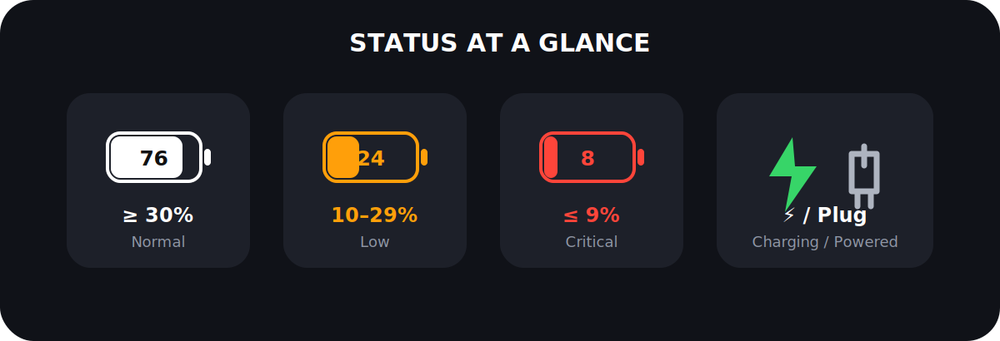
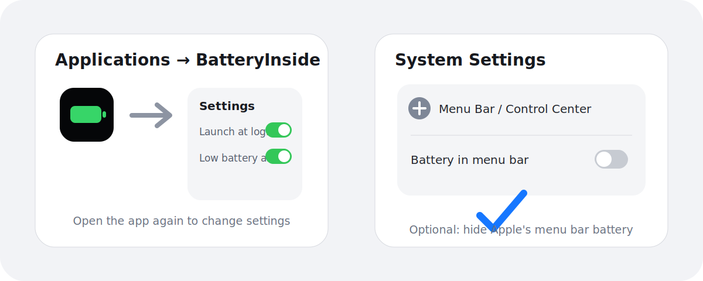

# BatteryInside

[中文](../README.md) · [English](README.en.md) · [日本語](README.ja.md) · [Français](README.fr.md) · [Italiano](README.it.md)

BatteryInside è un indicatore macOS leggero e di sola lettura che mostra percentuale, livello residuo e stato di alimentazione in un'unica icona compatta.

Autore: Guo Peng (郭鹏)

## Installazione in tre passaggi

1. Scarica l'ultimo file `BatteryInside-versione.dmg` dalla pagina [Releases](/guopengnaivoc/battery-inside/releases/latest).
2. Apri il DMG e trascina BatteryInside in Applicazioni.
3. Apri BatteryInside da Finder → Applicazioni. L'indicatore apparirà nella barra dei menu.

### Se macOS blocca il primo avvio

La versione pubblica attuale usa una firma ad hoc e non è autenticata con Apple Developer ID. Se macOS comunica che lo sviluppatore non può essere verificato:

1. Prova ad aprire l'app una volta e chiudi l'avviso.
2. Apri Impostazioni di Sistema → Privacy e sicurezza.
3. Nella sezione Sicurezza trova il messaggio relativo a BatteryInside e fai clic su Apri comunque.

Fallo solo per un pacchetto scaricato dalla Release GitHub ufficiale e con checksum SHA-256 corrispondente. Non disattivare Gatekeeper globalmente.

## Stato a colpo d'occhio

- 30% o più: bianco
- 10%–29%: arancione
- 9% o meno: rosso
- In carica: fulmine
- Collegato all'alimentazione ma non in carica: spina
- Dati non disponibili: `--`

Lo stato di alimentazione viene determinato usando esclusivamente i valori macOS espliciti `Is Charging`, `Power Source State` e `Is Charged`.

## Impostazioni e sostituzione dell'icona di sistema

L'indicatore nella barra dei menu è di sola lettura e non reagisce ai clic. Per modificare le impostazioni, riapri BatteryInside da Finder → Applicazioni. Puoi attivare l'avvio al login, gli avvisi al 20% e al 10%, uscire o disinstallare l'app in sicurezza.

Per mantenere soltanto BatteryInside nella barra dei menu:

- macOS recente: Impostazioni di Sistema → Barra dei menu → Controlli della barra dei menu → Batteria
- macOS 13–15: Impostazioni di Sistema → Centro di Controllo → Batteria → disattiva Mostra nella barra dei menu

Questo non elimina né modifica le funzioni batteria di macOS. Riattiva l'opzione nello stesso punto per ripristinare l'icona Apple.

## Requisiti e privacy

- macOS 13 o successivo
- Mac Apple silicon e Intel
- Nessun accesso alla rete, analisi o raccolta dati

## Copyright

Copyright © 2026 郭鹏. Al momento non è inclusa alcuna licenza open source; la visibilità pubblica non concede il permesso di copiare, modificare o ridistribuire il codice.
